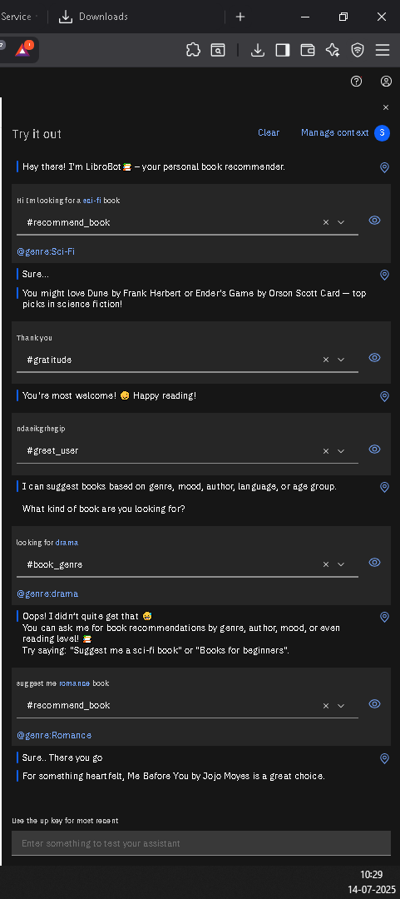
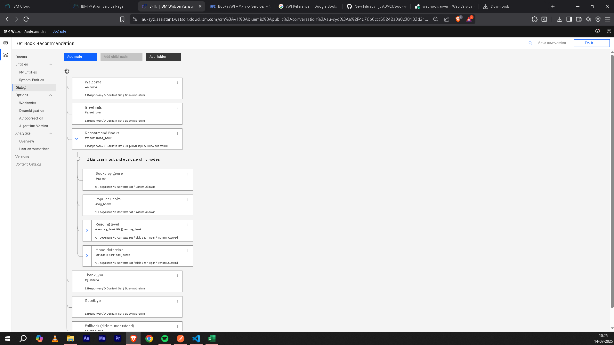
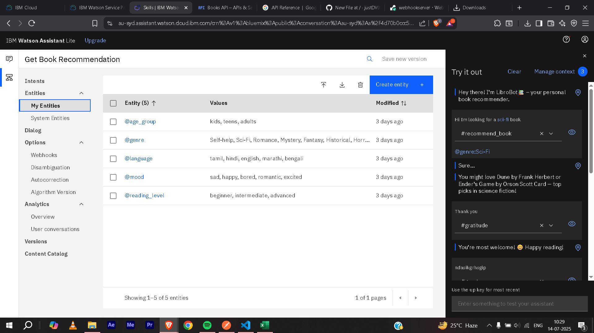
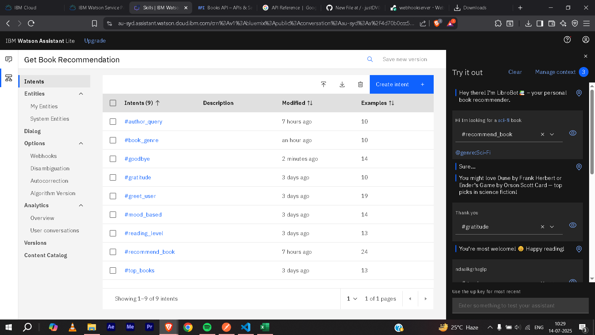

# LibroBot📚 (A Book Recommendation Chatbot using Watsonx Assistant)

This is a smart conversational assistant that recommends books based on genre, mood, reading level, or author. Built using IBM Watsonx Assistant.

## 🔧 Features
- Genre-based book suggestions (Mystery, Romance, Sci-fi, etc.)
- Mood-based suggestions (sad, happy, bored)
- Beginner, intermediate, advanced reading level support
- Fallback handling and conversation-friendly design

## 🚀 How It Works
1. Built intents, entities, and dialog nodes inside Watsonx Assistant
2. Exported the assistant as JSON
3. Trained with varied user phrases and responses
4. Tested with genre, mood, and reading-level-based inputs

## 📁 Files Included
- `assistant_export.json`: Full Watson Assistant project
- `screenshots/`: Visual flow of the chatbot
- `docs/how_it_works.md`: Breakdown of logic and structure

## 📸 Screenshots
Chatbot demo - 

Dialog Nodes - 
Entities - 
Intents - 

## 🛠 Tools Used
- IBM Watsonx Assistant
- IBM Cloud (optional)
- Git & GitHub for version control

## 👤 Author
Dhruv — B.Tech ECE 2nd Year  
